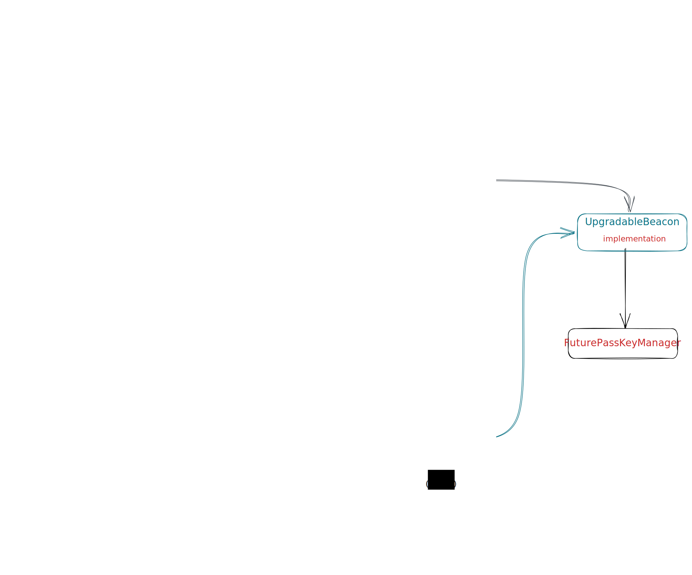
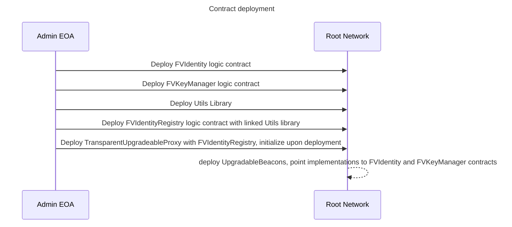
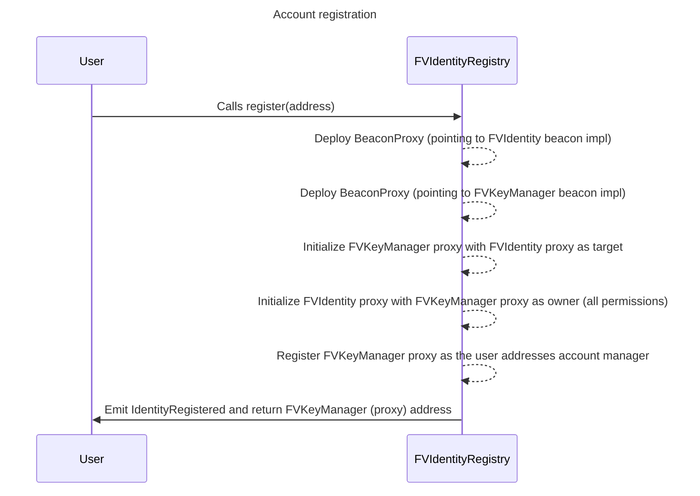

# Futureverse Wallet

This repo includes implementation of EIP725 based wallet and an account registry contract (to register wallet for new users).

## Account registry

## Wallet

Consists of 2 contracts - which work together to implement the ERC725Account spec:

- `KeyManager` - based on [LSP6](https://github.com/lukso-network/LIPs/blob/main/LSPs/LSP-6-KeyManager.md)
- `ERC725Account` - based on [LSP0](https://github.com/lukso-network/LIPs/blob/main/LSPs/LSP-0-ERC725Account.md)

### KeyManager

Responsible for permissions ([ERC725Y](https://github.com/ethereum/EIPs/blob/master/EIPS/eip-725.md#erc725y) substandard).
A manager/owner and entrypoint for the ERC725Account (controls the `ERC725Account` contract).

Why do we need this?

- allows the `ERC725Account` contract to be managed by multiple addresses (since `ERC725Account` is only managed by a single address)
- enables de-coupling of the permissions logic of the `ERC725Account` contract
- enables upgradability of the permissions logic (`KeyManager`)

#### KeyManager standards - ERC165 `0xfb437414`

- ERC165
- ERC1271

### ERC725Account

Responsible for execution ([ERC725X](https://github.com/ethereum/EIPs/blob/master/EIPS/eip-725.md#erc725x) substandard - for calls, contract deployments).

Management of the ERC725Y functionality (data key-value store) is provided by the owner `KeyManager` contract.

#### ERC725Account standards - ERC165 `0x66767497`

- ERC165
- [ERC725Y](https://docs.lukso.tech/standards/universal-profile/lsp0-erc725account/#erc725y---generic-key-value-store)
- [ERC725X](https://docs.lukso.tech/standards/universal-profile/lsp0-erc725account/#erc725x---generic-executor)
- [LSP1-UniversalReceiver](https://docs.lukso.tech/standards/universal-profile/lsp0-erc725account/#lsp1---universalreceiver)
- [ERC1271](https://docs.lukso.tech/standards/universal-profile/lsp0-erc725account/#erc1271)
- [LSP14Ownable2Step](https://docs.lukso.tech/standards/universal-profile/lsp0-erc725account/#erc1271)
- LSP17Extendable

note: This bytes4 interface id is calculated as the XOR of the interfaceId of the following standards: ERC725Y, ERC725X, LSP1-UniversalReceiver, ERC1271, LSP14Ownable2Step and LSP17Extendable.

- Additional docs: https://docs.lukso.tech/standards/universal-profile/lsp0-erc725account/#what-does-this-standard-represent-

## Architecture



- The [FVIdentityRegistry](./src/FVIdentityRegistry.sol) is the core contract which is responsible for creating user digital identities/accounts
  - It is deployed via TransparentUpgradableProxy pattern - to support future upgrades
  - note: We do not use hardhat upgrades lib to deploy the proxy, instead an EOA is simply set as the proxy owner (instead of a contract)
- The [FVIdentity](./src/FVIdentity.sol) is a modified version of the LSP0/ERC725Account contract, this is the digital identity contract (responsible for on-chain actions/calls)
  - This is deployed as a logic contract (implementation which a beacon proxy would point to)
- The [FVKeyManager](./src/FVKeyManager.sol) is modified version of the LSP6 contract, this is responsible for the permissions logic of the FVIdenttity contract
- `UpgradableBeacon` - 2 upgradable beacons are deployed, which point to `FVIdentity` and `FVKeyManager` implementation contracts
  - The beacon proxy pattern is used here (described [here](https://docs.openzeppelin.com/contracts/3.x/api/proxy)), this allows admin to upgrade all user accounts (FVIdentity and FVKeyManager) in case new functionality/fixes are to be introduced. This is a cost-effective approach to support mass-upgrades on all user accounts (with single TX)
- The `register(address)` function is used to create new digital identity for an address
  - This creates a `BeaconProxy` pointing to the `FVIdentity` upgradable beacon; inheriting logic of the `FVIdentity` contract
  - This also creates a `BeaconProxy` pointing to the `FVKeyManager` upgradable beacon; inheriting logic of the `FVKeyManager` contract
  - The proxies are setup such that the user's `FVKeyManager` proxy points to the `FVIdentity` (target) and the `FVIdentity` proxy owner is set to be the `FVKeyManager` proxy contract
    - The owner of the `FVKeyManager` proxy is the EOA (address being registered)
      - The `FVKeyManager` proxy contract is the only entrypoint into the `FVIdentity` proxy contract (user's digital identity)
  - note: The proxies only hold state of the respective contracts, they are upgradable (upgrading beacon upgrades digital identity contract logic)

### Deployment procedure

The [deployment script](./scripts/deploy.ts) will perform the following actions:



### User registration flow



## Setup

### Pre-requisites

- [foundry](https://book.getfoundry.sh/getting-started/installation) must be installed

### Install, Build, Test

Retrieve git submodules:

```sh
forge install
```

Build contracts:

```sh
forge build
```

Run tests:

```sh
forge test
```

### Deployment

Copy the `.env.example` file to `.env`  and fill in the required values.

```sh
cp .env.example .env
```

Note: Dummy values (private key and public address) for `Alice` have been provided.

#### Deploying to local network

1. Start [local node (e.g. anvil)](https://book.getfoundry.sh/tutorials/solidity-scripting#deploying-locally)
2. Run command:

**Hardhat:**

```sh
yarn deploy:local
```

**Forge:**

```sh
forge script script/RegistryDeployer.s.sol:Deployment --fork-url http://localhost:8545 --broadcast
```

#### Prod deployment

**Hardhat:**

```sh
yarn deploy:porcini
```

**Forge:**

```sh
source .env
forge script script/RegistryDeployer.s.sol:Deployment --rpc-url $GOERLI_RPC_URL --broadcast --verify -vvvv
```

Note: The `--verify` flag will verify the deployed contracts on Etherscan.
Note2: Forge cannot be used to deploy to TRN - due to [issue](https://github.com/foundry-rs/foundry/issues/3868)

---

## Testing

```sh
forge test -vvv
```

### Gas golf

```sh
forge test --gas-report
```

1. Get gas results for unit tests as starting point
2. Make changes
3. Rerun gas tests
4. Compare results

---
